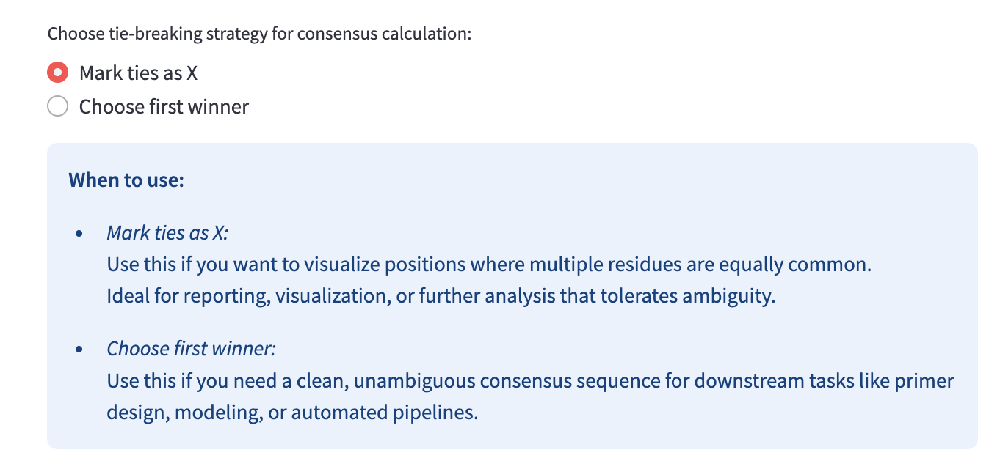
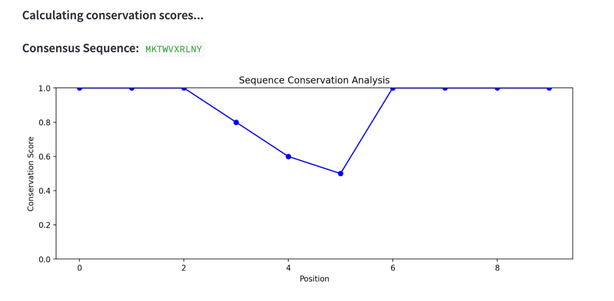

# MOL3022 - Sequence Diversity Analyzer

The Sequence Diversity Analyzer is a tool designed to analyze sequence conservation and diversity across multiple protein sequences. It aligns the sequences, calculates conservation scores, and visualizes sequence variability.

The project is developed for the course [MOL3022 - Bioinformatics - Method Oriented Project](https://www.ntnu.edu/studies/courses/MOL3022#tab=omEmnet) and consists of a Python script with a Streamlit-based front-end.

## How to run the project

1. **Download a protein sequence dataset in FASTA format.**
   - You can obtain protein sequences from [UniProt KnowledgeBase](https://www.uniprot.org/uniprotkb?query=reviewed:true) by clicking the "Download" button.
   - Ensure the file is in uncompressed FASTA format before proceeding.

2. **Install MAFFT.**
   - The tool requires MAFFT for multiple sequence alignment. Install it using the following commands:
     - **Ubuntu/Debian:** `sudo apt install mafft`
     - **Mac (Homebrew):** `brew install mafft`
     - **Windows:** Download from 
     [MAFFT website](https://mafft.cbrc.jp/alignment/software/) and add it to your system's PATH.

3. **Install the necessary dependencies.**
   - Open a terminal and navigate to the project folder.
   - Run the command:
     ```
     pip install -r requirements.txt
     ```

4. **Run the project using Streamlit.**
   - Execute the following command in the terminal:
     ```
     streamlit run main.py
     ```

## Expected results

When you run the tool, your browser will open and connect to the Streamlit application. You will see an interface allowing you to upload a FASTA file containing multiple sequences.

### **Features:**
- **Upload a FASTA file**: The tool accepts a multi-sequence FASTA file as input.
- **Align sequences**: The tool automatically aligns sequences using MAFFT.
- **Compute conservation scores**: Each position in the alignment receives a conservation score, indicating how conserved the residue is across sequences.
- **View a consensus sequence**: The most common residues at each position are displayed. The user can choose between two tie-breaking strategies for consensus calculation.
- **Visualize conservation**: A graph plots conservation scores across the sequence, highlighting conserved and variable regions.

### **Sample interface:**

#### Uploading a FASTA file:


#### Chossing tie breaking method:



#### Consensus sequence and conservation plot:


## Scoring Method

The conservation score is calculated as:
  ```
  Score = 1 - (Number of unique residues at position / Total sequences)
  ```
A score of **1.0** indicates complete conservation at that position, while lower scores indicate more variability.

## Sample Data

If you don’t have a FASTA file, you can download a sample file from the tool’s interface to test its functionality.

---
This tool provides an intuitive way to analyze protein sequence conservation and can be applied to evolutionary studies, protein function analysis, and mutation impact assessments.

